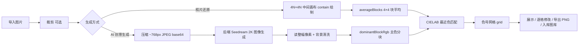

# 拼豆图纸 Pindou

把任意照片变成可以照着拼的像素图纸。导入一张图片 →（可选）裁剪 → 选择生成方式 → 像素化并映射到拼豆标准色 → 生成、展示、逐格修改、导出拼豆图纸。

基于微信小程序原生开发 + 微信云开发构建：**照片还原**完全本地离线、免费；**创意生成**调用火山方舟豆包 Seedream 图像模型，支持多种风格与自定义提示词。

## 功能特性

- **两种生成方式**
  - 照片还原：本地离线计算，无网络依赖、不消耗配额
  - 创意生成：AI 生成像素风格图纸，需登录，每张原图 3 次免费预览，可解锁
- **色系与盘面**：48 / 72 / 144 / 221 色套装；52×52 / 78×78 / 104×104 快捷档位，滑块与输入框支持 15×15 ~ 208×208
- **任意比例裁剪**：方框拖动移动、四边/四角调整大小，最终图纸保持方形网格
- **图纸展示**：canvas 绘制（逐格色号、双指缩放/拖动）、色号豆子数量清单、导出 PNG 到相册
- **逐格修改**：点格换色，底部"小盒子陈列"取色面板（按色系分区，只显示当前套装颜色）
- **创意生成风格**：卡通 / 马卡龙 / 写实风 + 自定义关键词；可开启"抠出主体（背景纯白）"；每张原图最多 3 个候选
- **个人中心与图库**：微信登录（云开发 openid）、头像昵称、菜单区（去生成/我的图库/常见问题/关于拼豆）、图纸自动入库（分页、缩略图/预览图、cloud:// 直接预览、编辑后回填）

## 生成流程



### 照片还原（免费离线）

1. 选图 →（可选）裁剪
2. 主页面用 `wx.createOffscreenCanvas` 建立 **4N×4N** 中间画布，按 contain 绘制（白底补齐、透明像素按白）
3. `averageBlocks`：每 4×4 块求平均 RGB，得到 N×N 代表色（不做任何平滑/合并/去噪）
4. `mapRgb`：sRGB → CIELAB 最近色匹配，只输出当前套装内色号 → grid

### 创意生成（AI）

1. **门禁与配额**：仅登录用户可用；服务端 `ai_sessions` 按 `(openid, imageHash)` 计数，每张原图最多 3 次免费预览
2. 原图压缩为 ~768px JPEG base64，连同 `sessionId / imageHash / 风格 / 抠图开关` 提交后端
3. 后端（`local` 本地代理或 `cloud` 云函数）调用火山方舟 OpenAI 兼容接口 `images/generations`：默认模型 `doubao-seedream-5-0-260128`，`2K` 尺寸，`watermark: false`，随机种子
4. 固定携带参考图：两张"原图转像素图"示例合成参考拼图 + 一张五官画法示例拼图（仅用于学习画法，提示词明确禁止复制示例角色/内容）；写实风使用写实参考样例
5. 前端把返回的图纸图片写入临时文件 → offscreen canvas 读整幅像素 → `cleanImageData` 清洗背景近白噪声 → `dominantBlockRgb` 按盘面主色分块（抗 AI 自带网格线/辅助线）→ `mapRgb` 映射到套装色号
6. 未解锁时以"锁定预览"（纯色、不可交互）展示，解锁后进入完整交互；解锁/导出时自动入库图库

## 技术栈

- 微信小程序原生开发（JS + WXML + WXSS，无 TypeScript，无第三方 npm 运行时依赖）
- 微信云开发：云函数 + 云数据库 + 云存储
- Node.js 纯函数工具层（`color` / `pattern` / `ai` / `background` / `gesture` / `session` 等），可在 Node 中直接单测
- AI 生成：火山方舟豆包 Seedream（OpenAI 兼容接口）

## 项目结构

```
miniprogram/
  app.js / app.json          小程序入口，云开发初始化，登录态恢复
  config.js                  云环境 ID、AI 生成后端（local / cloud）与本地地址
  custom-tab-bar/            自定义 tabBar（首页 / 个人中心）
  page/index/                主页面：选图、色系/盘面、生成方式、风格选择
  page/crop/                 裁剪页（任意比例方框）
  page/pattern/              图纸展示页（缩放/拖动、色号清单、导出、锁定预览）
  page/pattern-edit/         图纸修改页（逐格改色 + 小盒子取色面板）
  page/profile/              个人中心（登录、资料、菜单区、图库入口）
  page/gallery/              图库（分页列表、cloud:// 预览、编辑入口）
  utils/color.js             sRGB→CIELAB、最近色匹配、按套装构建调色板
  utils/pattern.js           网格映射/计数/序列化/canvas 绘制 + 照片还原采样
  utils/export.js            图纸资产生成（整图导出 / 网格缩略图 / 原图方形压缩）
  utils/ai.js                AI 生成前端：压缩、调用、轮询、像素映射色号
  utils/background.js        背景近白噪声清洗（flood fill）
  utils/image.js             图片加载（iOS 缓存绕过 + 超时重试）
  utils/gesture.js           双指缩放/拖动视图模型（纯函数）
  utils/hash.js              FNV-1a 图片哈希（配额计数用）
  utils/session.js           创意生成会话（每图最多 3 个候选）
  utils/user.js              云函数封装（account / access / gallery）
  data/colors.json|js        色卡数据源（48/72/144/221 套装）
  styles/tokens.wxss         设计令牌
scripts/build-colors.js      解析色卡文档 → 生成 data/colors.json 与 colors.js
tools/ai-generate-server.js  本地 AI 生成代理服务（提交任务 + 轮询，默认端口 8787）
tools/prompt.js              AI 生成提示词构造（纯函数）
tools/style-refs/            参考拼图源图（ref-pack.jpg / realistic-ref.jpg）
tools/face-refs/             五官画法示例拼图（face-ref.jpg）
cloudfunctions/
  account/                   用户中心（login / getProfile / saveProfile）
  access/                    访问控制（consumeQuota / checkAccess / createOrder / unlock）
  gallery/                   图库（save / list / get / update）
  ai-generate-pattern/       AI 生成调度云函数（start/status + 延时触发 worker）
  ai-generate-worker/        AI 生成 worker（独立 60s 预算：Seedream 生成 + 上传云存储）
tests/                       Node 单测（无框架，断言失败即非 0 退出）
```

## 云开发

### 云函数

| 云函数 | 职责 |
|---|---|
| `account` | 登录/资料（login / getProfile / saveProfile） |
| `access` | 配额计数、访问校验、下单与解锁（`PAY_MODE=mock` 默认模拟支付成功） |
| `gallery` | 图库入库、分页列表、单条详情、编辑保存/回填 |
| `ai-generate-pattern` | AI 生成调度（异步任务 start/status，延时触发 worker，仅校验登录） |
| `ai-generate-worker` | AI 生成执行（独立调用、完整 60s 预算，Seedream 出图 + 上传云存储） |

### 数据库集合

| 集合 | 用途 |
|---|---|
| `users` | 用户资料（昵称、头像） |
| `ai_sessions` | 按 `(openid, imageHash)` 记录生成次数与解锁状态 |
| `orders` | 解锁订单（mock 支付） |
| `gallery` | 图纸记录：原图/图纸/缩略图/预览图 fileID + 序列化 `grid`（行优先逗号色号串） |

图库列表接口用字段投影排除体积较大的 `grid`，编辑时按需 `get` 单条。

## 快速开始

1. 用[微信开发者工具](https://developers.weixin.qq.com/miniprogram/dev/devtools/download.html)导入项目根目录，点击"编译"
2. 开通云开发环境，把 `miniprogram/config.js` 中的 `envId` 替换为自己的环境 ID
3. 在开发者工具中分别右键 `account` / `access` / `gallery` / `ai-generate-worker` / `ai-generate-pattern` → "上传并部署（云端安装依赖）"（先部署 worker，再部署调度函数，避免延时触发时找不到函数）
4. 运行单测：

```bash
node tests/color.test.js && node tests/pattern.test.js && node tests/ai.test.js && node tests/user.test.js && node tests/background.test.js && node tests/gesture.test.js
```

### AI 生成本地模式（开发调试）

1. 复制 `.env.example` 为 `.env`，填写 `ARK_API_KEY`（火山方舟 API Key）
2. 启动本地服务：`node tools/ai-generate-server.js`（默认端口 8787）
3. 把 `miniprogram/config.js` 的 `aiGenerate.backend` 设为 `'local'`，`localUrl` 用启动日志打印的地址
4. 开发者工具需勾选"不校验合法域名"；真机调试时手机与电脑需同一 Wi-Fi（或连电脑热点），`localUrl` 填电脑局域网 IP

### 云函数模式

- `miniprogram/config.js` 的 `aiGenerate.backend` 设为 `'cloud'`
- 云函数 `ai-generate-worker` 需配置环境变量：`ARK_API_KEY`（必填）、`ARK_MODEL`（可选，默认 `doubao-seedream-5-0-260128`）；`ai-generate-pattern` 无需密钥，仅负责调度
- 云函数超时保持默认 60s：生成在 worker 独立调用中执行，每次调用拥有完整 60s 预算，无需（也无法）调大；`ai-generate-pattern` 目录的 `config.json` 声明云调用权限 `cloudbase.addDelayedFunctionTask`（重新部署后权限缓存约 10 分钟）；部署目录含 `face-ref.jpg`

### 生成与费用

- 免费：登录后即可使用创意生成（AI 出图成本由开发者承担，用户不付费）；照片还原完全离线免费
- 邀请码与配额逻辑已移除；`access` 云函数的 `createOrder`/`unlock` 分支保留兼容旧版客户端

## 测试

`tests/` 下为无框架 Node 单测，覆盖颜色匹配、网格算法、AI 像素映射、背景清洗、手势模型与用户云函数封装，全部用例当前通过。

## 许可

MIT License，详见 [LICENSE](LICENSE)。