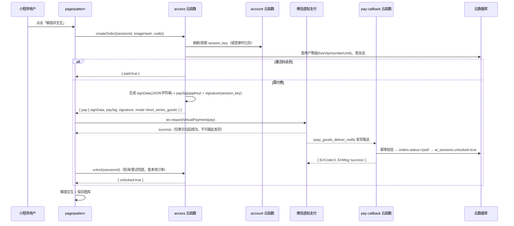

# 拼豆小程序用户付费（虚拟支付）接入技术文档

> 日期：2026-08-07　状态：方案评审稿（**尚未改动任何代码**）
> 范围：为「AI 创意生成」增加付费解锁能力 —— 普通用户单次 0.8 元、普通会员单次 0.5 元、激活码（邀请码）会员完全免费。

## 0. 结论先行

1. **你的付费内容属于"虚拟商品/付费功能"**（解锁功能、AI 服务次数），按微信 2026-02-27 公告、2026-04-01 起执行的规则，**必须接入「小程序虚拟支付」**，不能再用普通微信支付（`wx.requestPayment`）卖虚拟商品，否则属于违规，轻则限制功能、重则暂停服务。
2. 虚拟支付与普通微信支付是**两套独立体系**：需要在小程序后台开通虚拟支付，获得**独立的二级商户号**（不是普通微信支付商户号），走专用接口 `wx.requestVirtualPayment`，iOS 端自动路由到 Apple 支付。
3. 代码侧的核心改动集中在 `cloudfunctions/access`（下单+签名）、新增支付回调云函数、`page/pattern` 解锁按钮、`account` 登录（获取 session_key）、`users/orders` 数据模型。
4. **有 3 个必须先确认/决策的点**（详见第 6 节）：
   - 小程序当前**主体类型**：个人主体无法开通任何支付，必须先转企业/个体工商户并完成微信认证（300 元/年）；
   - **iOS 端最低支付金额为 1 元**：0.8 元/0.5 元的单价在 iPhone 上无法发起支付，需要决定 iOS 策略；
   - **"普通会员"如何获得、价格多少**：本文档按"购买会员资格道具 → 会员期内按 0.5 元/次解锁"设计，会员价格待你确认。

---

## 1. 现状与目标

### 1.1 现有实现（已核对代码）

| 位置 | 现状 |
|---|---|
| `cloudfunctions/access/index.js` | `PAY_MODE=mock`（默认）：`createOrder` 直接写一条 `status:'paid'` 订单并解锁，没有真实支付；`UNLOCK_PRICE=100`（分，即 1 元）；`unlock` 校验订单后置 `ai_sessions.unlocked=true` |
| `cloudfunctions/account/index.js` | 邀请码 `GBNLY99`（环境变量 `INVITE_CODE`）→ `users.freeVip=true`，免费 |
| `miniprogram/page/pattern/index.js` | `onUnlock`：`user.createOrder(sessionId, imageHash)` → `user.unlock(sessionId)` → 解锁交互 + 入库图库 |
| 数据模型 | `users{freeVip, inviteCode}`、`ai_sessions{attempts, unlocked}`、`orders{amountFen, status:'paid'}` |
| 配额 | 每张原图免费预览 3 次（`ai_sessions.attempts`），解锁后不限；`freeVip` 不限 |

### 1.2 目标模型

| 用户等级 | 判定依据 | 单次解锁价格 | 说明 |
|---|---|---|---|
| 普通用户 | 默认 | 0.8 元（80 分） | 免费预览 3 次后付费解锁 |
| 普通会员 | `users.memberUntil > now` | 0.5 元（50 分） | 会员资格购买方式/价格**待定** |
| 激活码会员 | `users.freeVip=true`（现有邀请码） | 免费 | 逻辑不变 |

免费预览 3 次/图的配额规则**保持不变**。

---

## 2. 你需要先在微信侧做的事（操作清单）

> 以下按先后顺序执行；官方入口与文档链接见第 8 节。

### 2.1 确认资质（前置条件）

1. **主体类型**：登录 [mp.weixin.qq.com](https://mp.weixin.qq.com) 查看主体信息。
   - 个人主体小程序**不能开通任何支付**（普通微信支付、虚拟支付都不行），需要先完成"主体变更"为企业/个体工商户（或重新注册企业主体小程序），再完成微信认证。
   - 虚拟支付支持：企业、事业单位、个体工商户。
2. **微信认证**：认证费 300 元/年（未认证的小程序无法开通支付）。
3. **小程序备案**：2023 年 9 月起强制；未备案会限制搜索、分享、审核。请确认已完成。
4. **类目**：虚拟支付需要"虚拟类目"（工具、文娱、会员、知识付费等开放类目）。请在后台确认当前类目（AI 绘图建议选"工具-图片处理/设计"类或平台允许的对应类目）是否支持虚拟支付，若审核被拒需调整类目。
5. **AI 合规提醒**（与支付强相关，上架/支付审核会被核查）：
   - 生成式 AI 服务面向公众需完成安全评估 + 大模型备案 + 算法备案（"双重备案"），个人主体门槛较高；
   - 2025-09-01 起《人工智能生成合成内容标识办法》要求 AI 内容带**显式标识 + 隐式标识**。当前代码 `watermark: false` 关闭了模型自带水印，属于审核风险点，建议在付费功能上线前补上标识（见第 7 节）。

### 2.2 开通小程序虚拟支付

官方开通流程（MP 后台 → 左侧「虚拟支付」）：

1. **阅读并签署《虚拟支付协议》**；
2. **提交商户资料**：营业执照、对公提现账户、支付管理员信息（管理员若为公司法人可跳过后续账户验证）；
3. **等待审核**：一般 1~7 个工作日，审核状态可在页面查看；
4. **账户验证**（如支付管理员非法人）；
5. **扫码签约**；
6. 签约后约 1~2 个工作日，状态变为"已签约"，**二级商户号开通成功**，此时左侧「虚拟支付」变成商户管理模块。

> 注意：虚拟支付支持**对公账户提现**、结算周期 **T+3**；与普通微信支付商户号相互独立，不能混用。

### 2.3 商户管理后台配置（虚拟支付模块内）

1. **基础配置**：查看/记录三项关键参数 —— `appid`、`offerId`（支付应用 ID）、`appKey`（沙箱 AppKey + 现网 AppKey，签名用）；开启"道具发货推送"开关。
2. **道具配置**（道具直购模式，推荐本项目的计价方式）：
   - 道具 `ai_unlock`：单次解锁一张图纸，价格 **80 分**（0.8 元）；会员下单时服务端用 `activitySellingPrice=50` 传优惠价（50 分），无需单独道具；
   - 道具 `member_30d`（名称待定）：会员资格，价格**待你确认**（如 9.9 元）；
   - 道具配置需先"上传到开发版本"再"发布到现网版本"，发布后约 10 分钟生效；发布后价格不可随意改（改价需重新发布/审核）。
3. **iOS 端开通**（若决定支持 iOS 购买）：
   - 在「虚拟支付-基础配置」单独开通 iOS 支付，并**配置小程序简称**（Apple 支付要求展示名称）；
   - 要求用户微信 ≥ 8.0.68、iOS ≥ 15、仅限中国大陆 App Store 账户；**最低支付金额 1 元**。
4. **退款**：在「虚拟支付-交易订单」后台可对 180 天内的订单退款；iOS 退款由用户在 App Store 发起，走退款问询流程。

### 2.4 云开发控制台配置

本项目用云开发，回调不需要自建服务器：

1. **消息推送**：开发者工具 → 云开发控制台 → 设置 → 其他设置 → 消息推送 → 推送模式选「云函数」→ 添加推送配置：
   - 事件类型：`xpay_goods_deliver_notify`（道具发货推送，支付成功后触发）
   - 云函数：`pay-callback`（第 5.4 节新增，部署后选择）
2. **云函数环境变量**（右键云函数 → 云端安装依赖部署后配置）：
   - `access`：`VP_OFFER_ID`、`VP_APPKEY`（现网）、`VP_APPKEY_SANDBOX`、`VP_PRODUCT_UNLOCK=ai_unlock`、`PRICE_NORMAL_FEN=80`、`PRICE_MEMBER_FEN=50`、`PAY_MODE=prod`（开发期可 `sandbox`）
   - `pay-callback`：无（回调事件已含必要信息）
   - `account`：如采用 appid+secret 方式换取 session_key，需要 `APPID`/`APPSECRET`（见 5.2）

### 2.5 开发者工具侧

- 无需配置"不校验合法域名"（虚拟支付走微信客户端内置能力，不是 wx.request 域名）。
- 开发版/体验版可用沙箱环境（`env:1`）测试，不产生真实扣款；正式版只能用现网环境（`env:0`）。

---

## 3. 方案选择

| 方案 | 说明 | 结论 |
|---|---|---|
| A. 小程序虚拟支付（道具直购） | 专用二级商户号 + `wx.requestVirtualPayment`；安卓/鸿蒙/Windows 走微信支付，iOS 走 Apple 支付；2026-04-01 起虚拟商品唯一合规路径 | **推荐，本文档采用** |
| B. 普通微信支付（`wx.requestPayment` / 云开发 `cloud.cloudPay.unifiedOrder`） | 只适用于实物、线下服务；虚拟商品使用属于违规（限流/下架风险），且 iOS 端虚拟商品本就不允许展现购买入口 | 不适用 |
| C. 代币充值（`short_series_coin`） | 扣减必须为整数代币，0.8/0.5 元定价无法精确映射 | 不推荐 |

**结论**：道具直购（`mode: 'short_series_goods'`）+ 发货推送回调解锁 + 本地订单轮询兜底。

---

## 4. 业务与定价设计

### 4.1 定价与商品

| 场景 | 道具 | 服务端生成的 signData 价格 | 说明 |
|---|---|---|---|
| 普通用户单次解锁（安卓等） | `ai_unlock` | `goodsPrice: 80` | 与后台道具价一致 |
| 普通会员单次解锁（安卓等） | `ai_unlock` | `goodsPrice: 80, activitySellingPrice: 50` | 优惠价由服务端写入并签名，用户无法篡改 |
| 激活码会员 | 无 | 不发起支付，直接 `paid: true` | 现有 freeVip 逻辑 |
| iOS 单次解锁 | 待定 | ≥ 100 分 | **iOS 最低 1 元**，见 4.2 |
| 会员资格 | `member_30d` | 待确认 | 建议道具直购（非订阅，订阅对 iOS 有 90 天/DAU 门槛） |

金额一律使用**分**（整数），与现有 `orders.amountFen` 一致。

### 4.2 iOS 最低 1 元问题（必须决策）

官方规定 iOS 端（Apple 支付）**最低支付金额为 1 元**，0.8/0.5 元无法在 iPhone 上发起。可选策略：

- **A. iOS 隐藏单次解锁**：iOS 端解锁按钮提示"请使用安卓端完成单次购买"或仅提供会员资格购买（≥1 元）。实现最简单，先上线推荐；
- **B. iOS 单次提价 1 元**：iOS 用单独道具（`ai_unlock_ios`，100 分），与安卓价格不一致，需在产品说明中明示，且 iOS 会员 0.5 元折扣仍然不可用；
- **C. iOS 只卖次数包/会员**：如"3 次 3 元"次数包，每次解锁扣次数（需给 `users` 增加次数余额），复杂度中等。

> 建议先做 A（代码改动最小），后续需要时再做 C。**注意：0.5 元会员折扣在 iOS 上同样不可行**，iOS 会员的优惠只能体现为"会员资格更划算/次数包折扣"。

### 4.3 会员资格（待确认项）

- 建议：`users.memberUntil`（毫秒时间戳）表示会员到期时间；购买 `member_30d` 道具后由回调云函数写入 `memberUntil = max(now, memberUntil) + 30天`。
- 会员价格、时长请你确认后再实现购买入口；不阻塞"单次解锁 0.8 元"先行落地。

---

## 5. 代码修改技术方案

### 5.1 总体时序



### 5.2 签名与安全（虚拟支付核心）

`wx.requestVirtualPayment` 需要三个要素，**全部由服务端云函数生成**，前端只透传：

| 参数 | 算法 | 密钥来源 |
|---|---|---|
| `signData` | 服务端按固定字段顺序构造的 JSON **字符串**（前端不得重组字段） | 包含 offerId/buyQuantity/env/currencyType/productId/goodsPrice/activitySellingPrice/outTradeNo/attach |
| `paySig` | `hmac_sha256(appKey, 'requestVirtualPayment&' + signData)`，hex 输出 | MP 后台「虚拟支付-基础配置」的沙箱/现网 AppKey，按 `env` 选 |
| `signature` | `hmac_sha256(sessionKey, signData)`，hex 输出 | `auth.code2Session` 返回的 session_key |

要点：

1. **JSON 字符串必须与签名时完全一致**：Node 中 `JSON.stringify` 按属性定义顺序输出，服务端生成字符串 → 签名 → 原样返回前端 → 前端原样传入 `signData`。
2. **session_key 获取**：前端 `wx.login()` 拿 code → 云函数换 session_key。本项目当前没有维护 session_key，需要新增。两种方式：
   - 优先：云函数 `cloud.openapi.auth.code2Session({ js_code })`（云调用，不暴露 AppSecret；需在云开发控制台开通对应开放接口权限）；
   - 备选：云函数用 `APPID + APPSECRET` 调 `https://api.weixin.qq.com/sns/jscode2session`（AppSecret 只能放云函数环境变量，严禁放前端）。
   - session_key 有过期/被顶替风险，**建议下单时前端传新鲜 code**（`createOrder` 入参带 `code`），而不是只用登录时缓存的 key。
3. **防篡改**：价格、会员折扣由服务端按数据库用户等级判定后写入 signData 并签名；前端传任何价格/等级字段都不可信。
4. **发货以回调为准**：`wx.requestVirtualPayment` 的 success 可能因微信异常退出而丢失，**不能在 success 里发货**。发货（置订单 paid、解锁会话）只在 `xpay_goods_deliver_notify` 回调中执行；前端支付后轮询 `unlock` 兜底（本地订单状态）。

### 5.3 数据模型变更

| 集合 | 字段 | 说明 |
|---|---|---|
| `users` | `memberUntil`（新增，number，毫秒时间戳） | 普通会员到期时间；无/过期 = 普通用户 |
| `users` | `freeVip`（保留） | 激活码会员，免费 |
| `orders` | `outTradeNo`（新增，string，8-32 位） | 商户业务订单号，`PD + 时间戳 + 随机`，不以 `_` 开头 |
| `orders` | `productId`（新增） | 购买的虚拟支付道具 ID（`ai_unlock` 等） |
| `orders` | `amountFen`（保留） | 实际支付金额（分）：80/50/0 |
| `orders` | `attach`（新增） | 透传数据，建议只放 `sessionId`（解锁按 sessionId 查会话） |
| `orders` | `status`（保留） | `created → paid`（可增加 `refunded`） |
| `orders` | `transactionId`（新增） | 微信交易单号（回调 `WeChatPayInfo.TransactionId`） |
| `orders` | `env`（新增） | 0 现网 / 1 沙箱 |
| `orders` | `paidAt`（保留） | 支付时间 |
| `ai_sessions` | 不变 | `unlocked` 由回调云函数置 true |

### 5.4 代码修改清单（按文件）

> 改动遵循"外科手术式修改"：不动无关代码；删掉自己改动产生的孤儿（如不再使用的 mock 分支要保留注释说明或按约定处理，避免影响现有测试）。

#### 1) `cloudfunctions/account/index.js`（登录 + session_key + 会员字段）

- `login`/`getOrCreateUser`：`users` 默认字段增加 `memberUntil: 0`；
- 新增 action `refreshSession`（或并入 login）：入参 `code`，调用 `cloud.openapi.auth.code2Session`（或 jscode2session 备选）换取 `{ openid, session_key }`，将 `session_key` 按 `_openid` 存入（建议单独集合 `user_sessions{ _openid, sessionKey, updatedAt }` 或 users 文档字段；**session_key 属于敏感信息，只存云数据库，不下发前端**）；
- `getProfile` 返回用户时带 `memberUntil`（前端展示会员状态用）。

#### 2) `cloudfunctions/access/index.js`（下单核心改造）

- 环境变量改为：`VP_OFFER_ID`、`VP_APPKEY`、`VP_APPKEY_SANDBOX`、`VP_PRODUCT_UNLOCK`、`PRICE_NORMAL_FEN=80`、`PRICE_MEMBER_FEN=50`、`PAY_MODE=mock|sandbox|prod`（`mock` 保留给开发联调，`sandbox` 走沙箱 env=1，`prod` 走现网 env=0）；
- `createOrder` 重写：
  1. 补建会话逻辑保留；
  2. 判定等级：`freeVip → { paid:true }`；否则按 `memberUntil > Date.now()` 选 50 分或 80 分；
  3. `PAY_MODE=mock`：保留现有"直接写 paid 订单 + 解锁"分支（供开发测试）；
  4. `PAY_MODE=sandbox|prod`：生成 `outTradeNo` → 构造 `signData` 字符串（`attach` 放 sessionId）→ `paySig = hmac_sha256(appKey, 'requestVirtualPayment&' + signData)` → 用当前用户 session_key 算 `signature` → 写一条 `status:'created'` 订单（记 outTradeNo/amountFen/productId/env）→ 返回 `{ pay: { signData, paySig, signature, mode:'short_series_goods', outTradeNo, env } }`；
  5. **不做解锁**（等回调）。
- 新增 action `queryPaid`（可选）：按 sessionId 查 `orders.status='paid'`，供前端轮询兜底；
- `unlock` 逻辑保留（校验 paid 订单后解锁）。

#### 3) 新增 `cloudfunctions/pay-callback/index.js`（虚拟支付回调）

- 入口接收云开发消息推送的 event（`Event === 'xpay_goods_deliver_notify'`）：
  1. 取 `OutTradeNo`、`OpenId`、`GoodsInfo.Attach`（sessionId）、`WeChatPayInfo.TransactionId`；
  2. **幂等**：先查 `orders` 是否已 `status:'paid'`，是则直接返回成功；
  3. 更新订单 `status:'paid'`、`transactionId`、`paidAt`；
  4. 按 attach 里的 sessionId 置 `ai_sessions.unlocked=true`；
  5. 若 `productId === 'member_30d'`（待实现）则写 `users.memberUntil`；
  6. 返回 `{ ErrCode: 0, ErrMsg: 'success' }`（非 0 会被微信按 15s/15s/30s/3m/… 策略重试）。
- 可同时处理 `xpay_refund_notify`（订单置 `refunded`，可回收解锁状态，简单版先只记录）。

#### 4) `miniprogram/utils/user.js`

- `createOrder(sessionId, imageHash, code)`：入参加上 `wx.login()` 的 code（或独立 `refreshSession(code)`）；
- 新增 `requestVirtualPayment(pay)` 封装：兼容基础库版本判断（`wx.canIUse('requestVirtualPayment')`），失败错误码映射（-2 取消、-4 风控、-15013 价格错误等）转成用户可读文案；
- 新增 `queryPaid(sessionId)` 封装（轮询兜底）。

#### 5) `miniprogram/page/pattern/index.js` + `index.wxml`（解锁按钮）

- `onUnlock` 改为：
  1. `wx.login()` 取 code；
  2. `const r = await user.createOrder(sessionId, imageHash, code)`；
  3. `r.paid === true`（激活码/mock）→ 直接 `user.unlock(sessionId)`；
  4. 否则 `wx.requestVirtualPayment(r.pay)` → success 后**轮询** `unlock`/`queryPaid`（如 1s/2s/4s，最多 10 次；也可让用户手动点"已完成支付"重试）；
  5. 解锁成功后才进入现有解锁分支（改 locked、重绘、保存图库）。
- WXML：解锁按钮文案显示价格（普通 0.8 元 / 会员 0.5 元 / 免费）；iOS 端（`wx.getDeviceInfo().platform === 'ios'`）且未确认 iOS 策略前，隐藏或禁用单次解锁并提示（见 4.2 决策 A）；支付中按钮 loading 防重复点击。

#### 6) `miniprogram/page/profile/index.*`（可选，配合会员）

- 展示会员状态（`user.memberUntil`、`user.freeVip`）；
- 会员购买入口（道具 `member_30d`）——**等会员定价确认后再实现**。

#### 7) `miniprogram/config.js`

- 增加只读展示配置（价格/道具 ID/是否开启支付），前端不参与任何签名逻辑。

#### 8) `cloudfunctions/ai-generate-pattern/index.js`

- **无需改动**：`checkQuota` 已支持 `freeVip` 不限、`unlocked` 不限、3 次预览上限；
- 可选加固：生成前校验"该会话已解锁或未超 3 次"，与 `access` 保持一致（当前已是如此）。

#### 9) `tests/`

- `tests/user.test.js`（或新增 `tests/pay.test.js`）：单测签名算法（用官方文档示例向量校验 `pay_sig`/`signature`）、价格等级判定（freeVip/memberUntil/普通）、订单幂等逻辑；
- 运行：`node tests/color.test.js && node tests/pattern.test.js && node tests/ai.test.js && node tests/user.test.js`；
- 改动 JS 一律 `node --check <file>`。

#### 10) `.env.example` 与部署说明

- 补充 `access`/`pay-callback`/`account` 云函数所需环境变量注释；
- 部署顺序：先部署 `pay-callback` 并在云开发控制台配好消息推送，再部署 `access`/`account` 新版本，最后发布小程序端。

### 5.5 关键伪代码

**access/createOrder（核心）**

```js
const crypto = require('crypto')
// signData 字段顺序固定；生成的字符串必须与签名时完全一致
function buildSignData({ offerId, productId, goodsPrice, activitySellingPrice, outTradeNo, attach }) {
  const obj = {
    offerId,
    buyQuantity: 1,
    env, // 0 现网 / 1 沙箱
    currencyType: 'CNY',
    productId,
    goodsPrice,
    outTradeNo,
    attach
  }
  if (activitySellingPrice) obj.activitySellingPrice = activitySellingPrice
  return JSON.stringify(obj)
}
function paySig(appKey, signData) {
  return crypto.createHmac('sha256', appKey).update('requestVirtualPayment&' + signData).digest('hex')
}
function signature(sessionKey, signData) {
  return crypto.createHmac('sha256', sessionKey).update(signData).digest('hex')
}
```

**pay-callback（核心）**

```js
exports.main = async (event) => {
  if (event.Event !== 'xpay_goods_deliver_notify') return { ErrCode: 0, ErrMsg: 'success' }
  const { OutTradeNo, OpenId } = event
  const attach = event.GoodsInfo && event.GoodsInfo.Attach // 建议放 sessionId
  // 1. 幂等
  const order = await db.collection('orders').where({ outTradeNo: OutTradeNo }).limit(1).get()
  if (order.data.length && order.data[0].status === 'paid') return { ErrCode: 0, ErrMsg: 'success' }
  // 2. 更新订单
  await db.collection('orders').where({ outTradeNo: OutTradeNo }).update({
    data: { status: 'paid', transactionId: event.WeChatPayInfo && event.WeChatPayInfo.TransactionId, paidAt: db.serverDate() }
  })
  // 3. 解锁会话（attach 为 sessionId）
  await db.collection('ai_sessions').where({ _openid: OpenId, sessionId: attach }).update({
    data: { unlocked: true, updatedAt: db.serverDate() }
  })
  return { ErrCode: 0, ErrMsg: 'success' }
}
```

### 5.6 沙箱测试与上线步骤

1. 开发版/体验版：`PAY_MODE=sandbox`、`env:1`、沙箱 AppKey；用开发者工具/真机完成 正常支付、取消支付、断网重试、重复回调（手动触发两次发货推送）验证幂等；
2. 联调通过后：`PAY_MODE=prod`、现网 AppKey、`env:0`；在 MP 后台确认道具已发布；
3. 全终端回归：安卓（微信支付）、iOS（Apple 支付，需真机 + 微信 8.0.68+）、Windows/鸿蒙；
4. 上线后观察：订单状态、T+3 结算账单、退款流程。

---

## 6. 未决问题（需要你确认）

1. **当前小程序主体类型**：个人 / 企业 / 个体工商户？个人主体需先变更为企业/个体户并完成认证（影响所有后续步骤，最优先确认）。
2. **iOS 策略**：选 4.2 的 A（隐藏单次购买，推荐先做）、B（iOS 单次 1 元）还是 C（次数包）？
3. **普通会员**：如何购买（道具直购/其他）、价格、有效期（建议 30 天道具）；不确认则先只上线"普通用户 0.8 元"。
4. **类目**：当前小程序类目是否属于虚拟支付开放类目；AI 绘图类目选择。
5. **退款策略**：数字内容默认是否支持退款（影响 iOS 退款问询应答 evidence）。
6. **AI 内容标识**：是否在本次一并补显式/隐式标识（建议，否则审核风险）。

## 7. 风险与合规提醒

- **强制虚拟支付**：2026-04-01 起虚拟商品全终端必须走虚拟支付，否则限流/下架；请勿用普通微信支付替代。
- **iOS 最低 1 元**：0.8/0.5 元单价 iOS 不可用（见 4.2）。
- **费率**：安卓/鸿蒙/Windows 约 1%（2026 激励期）；iOS 2026 年为 12%（含苹果佣金，腾讯 5% 技术服务费 2026 年减免，标准费率为 17%）。0.8 元订单利润很薄，建议结合成本评估定价。
- **结算**：T+3，仅对公账户提现。
- **回调可靠性**：推送最多重试 15 次，务必幂等；`wx.requestVirtualPayment` success 不可作为发货依据。
- **AI 标识**：当前 `watermark: false` 与《AI 生成合成内容标识办法》冲突，付费审核/上架是高风险点。
- **生成式 AI 备案**：面向公众的 AI 生成服务需双重备案，主体与类目审核会核查。

## 8. 官方资料链接（请以官方最新文档为准）

- 虚拟支付产品介绍与开通：https://developers.weixin.qq.com/miniprogram/dev/platform-capabilities/business-capabilities/virtual-payment.html
- iOS 端接入：https://developers.weixin.qq.com/miniprogram/dev/platform-capabilities/business-capabilities/virtual-payment/ios.html
- wx.requestVirtualPayment：https://developers.weixin.qq.com/miniprogram/dev/api/payment/wx.requestVirtualPayment.html
- 虚拟支付签名详解：https://developers.weixin.qq.com/minigame/introduction/commercialization/virtual-payment/signature.html
- 云开发消息推送接收虚拟支付回调：https://developers.weixin.qq.com/miniprogram/dev/wxcloudservice/wxcloud/guide/wechatpay/virtual-payment-callback.html
- 虚拟支付服务端接口列表：https://developers.weixin.qq.com/miniprogram/dev/server/API/VirtualPayment/
- 普通微信支付（仅实物场景）：小程序支付开发接入准备 https://pay.wechatpay.cn/doc/v3/merchant/4015459512
- 2026-02-27 虚拟支付规范更新公告（转述）：https://m.mpaypass.com.cn/news/202603/02164733.html
