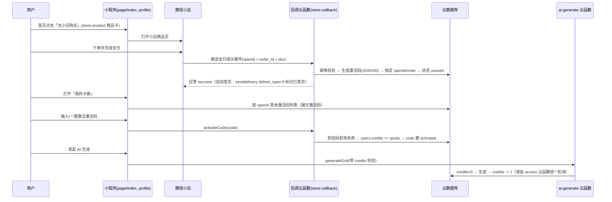

# 微信小店卖激活码 + 小程序填码激活 自动化流程技术文档

> 日期：2026-08-07　状态：方案评审稿（**尚未改动任何代码**）
> 目标：用户到你的微信小店购买「拼豆图纸生成次数包」（10 / 20 / 50 张图），支付后自动获得激活码，在小程序里填写激活码后按次数使用 AI 生成功能。
> 关联文档：[虚拟支付方案](2026-08-07-virtual-payment-design.md)（已搁置，本文档为替代路线）

## 0. 结论先行（请先读这一节）

1. **自动化技术链路是通的**：微信小店支持「小程序连接小店」——用户从小程序内嵌的小店商品卡下单，支付成功后小店会把订单事件推送到你配置的回调地址（含用户 openid），你的服务端收到后自动生成激活码、绑定订单，用户回到小程序「我的卡券」查看/填写激活码即可。整个流程无需人工发码。
2. **最大的障碍不是技术，是类目**：微信小店于 **2026-08-07（今天）生效《虚拟及衍生商品》类目新规**，虚拟类目（数字商品/会员卡券/AI 算力服务）**全部改为定向准入**：
   - 数字商品类目（最贴合"工具次数权益"）：**入驻主体仅限企业**，还需品牌商标、增值电信业务经营许可证、App 下载量 ≥ 1 亿；
   - AI 大模型服务类目：要求独立法人企业、注册 ≥ 2 年、注册资本 ≥ 200 万、等保三级、网信办双备案，个体户保证金 10 万元；
   - **个体工商户按现行公示标准基本无法上架"虚拟激活码"类商品**。
3. 因此本文档给出**三档可行路线**（详见第 6 节），并保留完整的自动化技术方案（第 3~5 节）——类目一旦走通（或换渠道卖码），代码方案可直接复用：
   - **路线 A（推荐先验证）**：先去小店后台实际添加商品，看你的店铺是否真的没有可选虚拟类目；同时联系微信小店官方客服确认个体户准入，别只凭文档下结论（规则以平台实际审核为准）。
   - **路线 B**：不在微信小店卖，改用**独立发卡站/第三方发卡系统**（支付后自动发码，用户复制激活码来小程序填）——个体户可做、成本低、不依赖小店类目。
   - **路线 C**：注册企业主体后再走小店虚拟类目（门槛高，一般不现实），或回到小程序虚拟支付方案（对公账户是卡点，见关联文档）。

---

## 1. 背景与现状

### 1.1 现状（已核对代码）

| 位置 | 现状 |
|---|---|
| `cloudfunctions/access/index.js` | `PAY_MODE=mock`，`createOrder` 直接写 paid 订单并解锁，无真实支付 |
| `cloudfunctions/account/index.js` | 邀请码 `GBNLY99`（`INVITE_CODE`）→ `users.freeVip=true` 全部免费 |
| `cloudfunctions/ai-generate-pattern/index.js` | `checkQuota`：freeVip 不限；否则每张原图免费预览 3 次，`unlocked` 后不限 |
| 前端 | `page/pattern` 解锁按钮走 `createOrder → unlock`；`page/profile` 有邀请码输入框 |

### 1.2 目标模型（本文档）

| 商品 SKU | 激活码配额 | 建议定价（待你确认） |
|---|---|---|
| 拼豆图纸生成 10 次包 | 10 次 | 待定（如 9.9 元） |
| 拼豆图纸生成 20 次包 | 20 次 | 待定（如 17.9 元） |
| 拼豆图纸生成 50 次包 | 50 次 | 待定（如 39.9 元） |

- 每次 AI 生成消耗 1 次额度（`users.credits` 减 1）；额度用完需再购买激活码。
- 现有 `freeVip`（GBNLY99 全免费）是否保留：见第 7 节待确认项，默认建议保留为测试/早期用户通道，不影响正式计费。
- 现有"每张图免费预览 3 次"是否保留：见第 7 节待确认项，默认按你的表述"填写激活码才能使用生成功能"改为**无额度不能生成**（也可保留 3 次免费体验）。

---

## 2. 微信小店侧需要做的事（操作清单）

> 以下步骤中，**第 1 步决定方案是否可行**，务必先做。

1. **开店并验证类目**（最优先）：
   - 用营业执照（个体工商户）入驻微信小店：实名微信号 + 营业执照 + 经营者身份证 + 经营者本人银行卡（个体户**不需要对公账户**，这点比小程序虚拟支付友好）。
   - 在小店后台尝试添加商品 → 搜索类目，看是否存在可选虚拟类目（如"虚拟及衍生商品"）。**按 2026-08-07 新规，个体户店铺大概率没有可选虚拟类目**；如果确实没有，跳到第 6 节选替代路线。
   - 如有可选类目，按平台要求提交资质（品牌/许可等）并咨询官方客服确认。
2. **上架商品**：创建 3 个 SKU（10/20/50 次包），价格、标题、主图（≥3 张）、详情页按《虚拟及衍生商品类目管理规则》要求写清楚：使用方式（在小程序「拼豆图纸」填激活码）、有效期说明、是否可退款、联系渠道；**不得宣传"永久/终身"**。
3. **关联小程序**：小店后台 → 店铺管理 → 关联账号 → 发起对小程序（wx223b76ceda8eb232）的绑定邀请；小程序侧接受后生效。关联后小程序才能内嵌小店商品卡。
4. **配置消息推送（回调）**：
   - 商家侧：小店后台 → 服务市场 → 经营工具 → 消息推送，配置回调 URL（收 `channels_ec_order_pay` 等事件）；
   - 渠道侧：小程序后台 → 开发管理 → 开发设置 → 消息推送，配置回调 URL（收 `related_shop_order_submission` 事件，带用户 openid）。
   - 回调 URL 必须是**公网可访问的 HTTPS**。本项目无自建服务器，可选用：云开发 HTTP 访问服务（云函数 HTTP 触发器）、微信云托管，或一台便宜的云服务器。**这是本项目需要新增的基础设施**。
5. **接入自研客服（可选）**：如需客服消息触达，在小店后台客服设置中"接入自研客服"（见第 5.2 节，非必须）。

---

## 3. 自动化流程总览



两个回调通道的关系：

| 通道 | 事件 | 用途 |
|---|---|---|
| 小店商家侧 | `channels_ec_order_pay` 等 | 拿到小店订单详情（order_id、SKU、金额），做发货动作（senddelivery） |
| 小程序渠道侧 | `related_shop_order_submission` | 拿到**用户 openid** + 渠道 order_id，用于把订单与小程序用户绑定、自动发码 |

> 注意：`related_shop_order_submission` 只覆盖"从小程序进小店下单"的用户；用户直接在微信里搜小店下单时收不到该事件。所以小程序内必须用 `<store-product>` 组件引导下单，把购买入口收口在小程序内。

---

## 4. 激活码设计

### 4.1 码格式与信息

- 格式建议：`PD-XXXX-XXXX-XXXX`（如 `PD-8F3K-9Q2M-7ZT1`），字符集用大写字母+数字去掉易混淆的 `0/O/1/I`，防止抄错。
- 码本身**只承载唯一标识**，不加密存储配额信息；配额（10/20/50）由数据库 `batch`/`quota` 字段决定（码可读性强、可撤销、可换批次）。
- 生成方式：预生成库存（脚本批量生成 → 入库 `codes` 集合），订单支付后从库存取一个码绑定订单（而不是支付时才生成，便于对账和补货）。

### 4.2 安全要点

1. **一次性**：`status: unused → activated` 原子流转，激活时用数据库事务/条件更新防并发重复激活（同码两个用户同时提交，只有一个成功）。
2. **防爆破**：激活接口限频（同一 openid 每分钟最多 N 次尝试）、连续失败锁定、码不随订单明文暴露在不可信渠道。
3. **防刷单**：只有收到**官方回调**（验签通过）才发码；不能信任前端/用户自报订单号。
4. **退款回收**：监听小店售后/退款事件，对已发码做作废或扣回未用次数（见 5.3）。
5. **幂等**：小店回调可能重复推送（最多 10 次/3.6h），以 `order_id` 幂等去重；应答失败会被重试，处理完必须返回成功。

---

## 5. 代码修改技术方案

### 5.1 新增/修改清单（按文件）

| 文件 | 改动 | 说明 |
|---|---|---|
| 新增 `cloudfunctions/store-callback/index.js` | 小店订单/售后回调 | 接收两套回调（商家侧 + 渠道侧），验签/解密 → 幂等 → 发码/绑定 openid → 自动发货（senddelivery）→ 售后回收 |
| 新增 `cloudfunctions/code/index.js`（或并入 `account`） | `activateCode / listMyCodes / getCredits` | 激活码激活、我的卡券列表、余额查询 |
| 修改 `cloudfunctions/access/index.js` | `consumeQuota` 改扣次数 | 无额度（且非 freeVip）→ 返回 `NO_CREDITS`；保留现有会话/解锁逻辑或按新模型简化 |
| 修改 `cloudfunctions/ai-generate-pattern/index.js` | `checkQuota` 同步改扣次数 | 与 access 保持一致（cloud 模式生成前校验 credits） |
| 修改 `cloudfunctions/account/index.js` | `getProfile` 返回 `credits` | 前端展示余额 |
| 修改 `miniprogram/utils/user.js` | 新增 `activateCode / listMyCodes / getCredits` 封装 | 云函数调用 |
| 修改 `miniprogram/page/profile/*` | 激活码输入框、余额展示、我的卡券列表、去小店购买入口 | UI |
| 新增 `miniprogram/page/codes/*`（可选） | 卡券详情/激活结果页 | 也可并入 profile |
| 修改 `miniprogram/page/index/*` | 生成前余额提示/跳转购买；内嵌 `<store-product>` 购买入口 | 引导从小程序下单 |
| 修改 `miniprogram/config.js` | 小店商品链接/店铺 ID、价格展示 | 只读展示 |
| 新增 `tools/gen-codes.js` | 批量生成激活码库存脚本 | node 脚本，node 可测 |
| 新增/修改 `tests/` | 码格式、激活原子性、幂等、扣次逻辑单测 | 无框架断言 |

### 5.2 发码与触达通道（对比）

| 通道 | 可行性 | 说明 |
|---|---|---|
| **小程序「我的卡券」页展示/激活（推荐）** | 可行 | 回调已带 openid，用户回小程序即见码；可"一键激活"或复制后填写 |
| 小程序订阅消息提醒 | 可行（需用户授权） | 下单前引导用户订阅"卡密到账"模板消息；一次性订阅，体验需设计 |
| 小店客服消息 | 受限 | 自研客服 API 只能给"正在沟通中"的用户发消息，不适合主动发码 |
| 短信 | 基本不可行 | 虚拟商品订单无收货地址/手机号，拿不到号码 |
| 小店订单页展示 | 不可行 | `senddelivery` 的虚拟发货（deliver_type=3）没有卡密/备注字段 |

### 5.3 回调处理伪代码（store-callback）

```js
// 两套回调共用：先解密/验签（EncodingAESKey），再按 Event 分发
exports.main = async (event) => {
  // 1. 幂等：order_id 已处理过 → 直接返回成功
  if (await isProcessed(orderId)) return ok()

  if (Event === 'channels_ec_order_pay') {          // 商家侧：拿订单详情
    const order = await getStoreOrder(orderId)       // channels.ec.order.get
    await markProcessed(orderId, { stage: 'paid' })
    return ok()
  }
  if (Event === 'related_shop_order_submission') {  // 渠道侧：拿到 openid
    const { FromUserName: openid, Data: { order_id } } = event
    // 生成/领取激活码并绑定
    const code = await takeUnusedCode(sku)          // 事务：unused -> bound
    await bindOrder({ openid, orderId: order_id, code })
    await sendDelivery(orderId)                     // deliver_type=3 标记虚拟发货
    await markProcessed(orderId, { stage: 'delivered' })
    return ok()
  }
  if (Event === '售后/退款事件') {                    // 回收
    await revokeCode(orderId, openid)               // 码作废 / 扣回未用次数
    return ok()
  }
  return ok()
}
```

> 实现要点：
> - 两套回调可能先后到达、顺序不定（可能先到渠道侧后到商家侧），以"发码+发货"为最终动作，商家侧只做订单记录，渠道侧负责发码；
> - 若渠道侧事件丢失（用户未从小程序进店），需要**定时对账**：定期拉取小店订单列表，把"已支付但未发码"的订单补发码（码绑定无 openid 时，用户回小程序凭订单号/手机号认领，或走客服）；
> - 小店 API 用**小店 access_token**（小店 appid+secret 换 token，云函数环境变量存放，缓存 2 小时）；优先尝试云调用（`channels.ec.order.delivery.send` 等），不支持则 HTTPS + access_token。

### 5.4 激活码激活伪代码（code 云函数）

```js
async function activateCode(openid, code) {
  // 限频防爆破
  // 事务/条件更新：status 必须为 unused（或 bound 且绑定本人）
  const res = await db.collection('codes').where({ code, status: db.command.in(['unused','bound']) }).update({
    data: { status: 'activated', activatedBy: openid, activatedAt: db.serverDate() }
  })
  if (res.stats.updated === 0) throw new Error('激活码无效或已被使用')
  // 给用户加次数（事务）
  await db.collection('users').where({ _openid: openid }).update({
    data: { credits: db.command.inc(quota) }
  })
}
```

### 5.5 数据模型变更

| 集合 | 字段 | 说明 |
|---|---|---|
| `codes`（新增） | `code`(唯一索引)、`batch`、`quota`(10/20/50)、`status`(unused/bound/activated/disabled)、`orderId`、`openid`、`activatedBy`、`activatedAt`、`createdAt` | 激活码库存 |
| `users` | `credits`（新增 number，默认 0） | 剩余生成次数 |
| `users` | `freeVip`（保留） | 免费通道（是否保留见待确认项） |
| `store_orders`（新增） | `orderId`(小店侧)、`channelOrderId`(渠道侧)、`openid`、`sku`、`amountFen`、`code`、`status`(paid/delivered/refunded)、`processedAt` | 小店订单同步表，幂等依据 |
| `ai_sessions` | 保留（3 次预览/解锁逻辑若保留则不动） | — |

### 5.6 关键交互改动（前端）

1. **首页**：AI 生成入口前检查 `credits`（或 freeVip）；无额度时弹窗提示"去小店购买次数包"，内嵌 `<store-product>` 商品卡（基础库 ≥ 3.7.0，需先完成小店关联）。
2. **个人中心**：
   - 顶部显示剩余次数（`credits`）；
   - 激活码输入框（沿用现有邀请码 UI，语义改为"激活码"）；
   - 「我的卡券」列表：展示已到账未激活的码（回调绑定 openid 后出现），支持复制/一键激活；
   - 保留现有邀请码入口仅当 `freeVip` 策略保留时。
3. **生成扣次**：`page/index` 生成 AI 图纸前调用 `consumeQuota`（cloud 模式由 `ai-generate-pattern.checkQuota` 校验），返回 `NO_CREDITS` 时引导购买；生成成功后 `credits` 展示刷新。

---

## 6. 类目与合规风险（重要）

### 6.1 微信小店虚拟类目现状（2026-08-07 生效）

| 类目 | 定向准入要求（公示标准） | 个体工商户 |
|---|---|---|
| 虚拟及衍生商品-会员卡券-数字商品（数字装扮/数字视听） | 仅限企业主体；品牌商标；增值电信业务经营许可证；App 下载量 ≥ 1 亿 | ❌ 被排除 |
| 虚拟及衍生商品-会员卡券-会员充值 | 仅限企业主体；软著；增值电信许可；下载量 ≥ 1 亿 | ❌ 被排除 |
| 虚拟及衍生商品-网络服务-AI 算力与服务-大模型服务 | 独立法人企业、注册 ≥ 2 年、注册资本 ≥ 200 万、等保三级、网信办双备案（保证金个体户 10 万元） | ❌ 被排除 |
| 会员实体卡 | 属于虚拟及衍生商品，定向准入 | 待确认，大概率受限 |

**结论**：以个体工商户身份在微信小店上架"虚拟激活码"，按现行公示规则基本无法通过。规则 2026-08-07 刚生效，且仍在完善，**最终以平台实际审核为准**——请先做第 2 节第 1 步的实地验证，并咨询小店官方客服。

### 6.2 替代路线（三选一）

- **路线 B（推荐落地）：独立发卡站/第三方发卡系统**。个体户可通过"易支付/码支付 + 发卡系统"（大量开源方案）收款自动发码；用户复制激活码来小程序粘贴激活。微信生态外收款，不依赖小店类目；代价是用户多一步"去外部站点购买"，信任成本更高（可挂在小程序"购买次数"页的说明中引导）。
- **路线 C：升级企业主体后回小店**。虚拟类目还要求增值电信许可、品牌、下载量等，个人/小团队几乎不可行；仅当后续有公司主体且资质齐全再考虑。
- **路线 A 的变体：卖实物"激活卡"**。若小店实物类目允许"卡片类"商品（如文具/贺卡类目），可把激活码印在实体卡上快递发货——但卡片类目归属需后台确认，且发货成本高、体验差，仅作兜底。

### 6.3 合规红线（无论走哪条路）

- 不要把虚拟商品挂到无关实物类目（"不得销售平台未开放类目的相关商品"，会被下架/处罚）。
- 商品不得宣传"永久/终身套餐"；次数包建议写"自购买之日起 X 年内有效"（有效期策略见待确认项）。
- 小程序端"购买入口"必须只做跳转/展示（`<store-product>` 组件），**不要在小程序内直接收款**，否则会触碰"虚拟支付"规则。
- 退款闭环：小店订单退款/售后后，必须回收激活码或扣回未用次数，避免资损和投诉。

---

## 7. 待确认问题

1. **类目可行性**（最优先）：去小店后台添加商品，确认你的个体户店铺有没有可选虚拟类目；并联系官方客服确认 2026-08-07 新规下个体户能否准入。这一步结果决定走 A 还是 B。
2. **SKU 定价**：10 / 20 / 50 次包分别定价多少？（文档用占位符）
3. **免费策略**：是否保留现有"每张图免费预览 3 次"和"邀请码 GBNLY99 全免费"？按你的表述默认改为"无额度不能生成"，如需保留体验额度请说明。
4. **激活码有效期**：如"自购买日起 1 年内有效"（注意不能写永久）。
5. **回调基础设施**：云开发 HTTP 访问服务（云函数 HTTP 触发器）当前环境是否可用？是否需要临时买一台云服务器/云托管？（这是自动化链路的前提）
6. **发码触达**：只做小程序「我的卡券」（推荐），还是叠加订阅消息提醒？
7. **对账方式**：是否需要定时任务拉取小店订单列表做"已支付未发码"补发（建议要）。

## 8. 参考资料（以官方最新文档为准）

- 微信小店《虚拟及衍生商品类目管理规则》（2026-08-07 生效）：https://store.weixin.qq.com/chengzhang/webdoc/wiki/9729/f8342e0db0409fbd/growth_center_rule_for_store/28
- 微信小店《虚拟及衍生商品定向准入和清退标准》（意见征集）：https://store.weixin.qq.com/chengzhang/webdoc/wiki/9668/0bb21709534432c7/growth_center_rule_for_store/29
- 微信小店虚拟及衍生商品新增类目公告：https://store.weixin.qq.com/chengzhang/webdoc/wiki/9666/b60cf4dd5bbd9a20/growth_center_platform_notice/1
- 小程序连接小店（关联、商品卡组件、事件通知）：https://developers.weixin.qq.com/doc/store/shop/guide/connect/miniprogram.html
- 小店订单事件通知：https://developers.weixin.qq.com/doc/store/shop/notify/order_callback/
- 小店订单发货接口（senddelivery，deliver_type=3 虚拟发货）：https://developers.weixin.qq.com/doc/store/shop/API/channels-shop-delivery/delivery/api_senddelivery.html
- 微信小店发货管理规则（无需物流/48 小时发货）：https://store.weixin.qq.com/chengzhang/article/wiki/407/e4ca8eb1ee772cf7/growth_center_rule_for_store
- 微信小店客服 API 开放模式：https://developers.weixin.qq.com/doc/store/shop/product/kf/kf_api_guidelines.html
