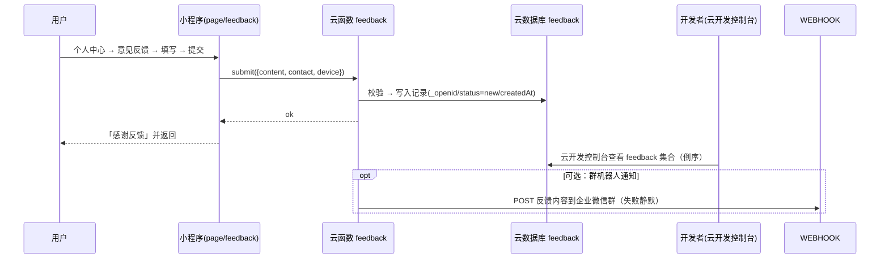

# 用户反馈模块设计稿

> 日期：2026-08-12　状态：**已确认并实现**（按确认：无联系方式、无机器人通知、内容上限 500 字）
> 目标：在个人中心加一个「意见反馈」入口，用户填写反馈后入库，开发者能方便地看到反馈内容。
> 关联：本项目为微信云开发小程序，无自建服务器；反馈的存储与查看完全基于云开发能力，不需要新增任何外部基础设施（可选的企业微信通知除外）。

## 0. 结论先行

1. **用户侧**：个人中心新增「意见反馈」菜单，进入反馈页，填内容（可选留联系方式）→ 提交 → 提示成功。
2. **开发者侧（你最关心的问题）**：反馈写入云数据库 `feedback` 集合，你在**云开发控制台 → 数据库 → feedback** 直接查看，按时间倒序，一眼能看到所有反馈及提交人（openid）。零成本、零依赖，这是最稳妥的默认方案。
3. **可选增强（以后想要"主动提醒"再加）**：提交反馈时云函数顺带调用**企业微信群机器人 Webhook**，把反馈内容推送到你的微信，做到实时通知。只需你建一个群机器人拿 URL，配到云函数环境变量即可；通知失败不影响入库。

---

## 1. 背景与现状

| 位置 | 现状 |
|---|---|
| `miniprogram/page/profile/index.wxml` | 菜单区现有：我的图库 / 常见问题 / 退出登录（`menu-card` 样式） |
| 云数据库 | 已有 `users` / `ai_sessions` / `gallery` / `orders` / `ai_tasks`，均由云函数写入 |
| 云函数 | 现有 `account` / `access` / `gallery` / `ai-generate-pattern` / `ai-generate-worker` / `sec-check` |
| 开发者后台 | 使用微信开发者工具云开发控制台（或网页版 CloudBase 控制台），可查看数据库集合 |

## 2. 功能设计

### 2.1 入口（改动 1 处）

个人中心菜单区，在「常见问题」下方、「退出登录」上方插入一个 `menu-card`：

```
我的图库
常见问题
意见反馈   ← 新增
退出登录
```

复用现有 `menu-card` / `menu-arrow` 样式，点击 `navigateTo` 到反馈页。

### 2.2 反馈页（新增页面 `page/feedback/index`）

| 元素 | 说明 |
|---|---|
| 标题 | 导航栏「意见反馈」 |
| 多行输入框 | 反馈内容，必填，`maxlength=500`，占位如"说说你的建议或遇到的问题…" |
| 提交按钮 | 点击后 loading，成功后 `showToast('感谢反馈')` 并返回上一页 |
| 校验 | 内容为空 → 提示"请填写反馈内容"；超长由 maxlength 限制 |

不新增 `data/` 静态资源，不改动 tabBar（反馈页用 `navigateTo` 进入，无底部 tab）。

### 2.3 数据模型（新增集合 `feedback`）

| 字段 | 类型 | 说明 |
|---|---|---|
| `_openid` | string | 自动记录提交用户（云函数侧） |
| `content` | string | 反馈内容（≤500） |
| `device` | string | 选填：系统/平台/基础库版本，帮助定位问题 |
| `status` | string | `'new'`（默认，待处理）；后续可在控制台手动改 `'done'` |
| `createdAt` | date | `db.serverDate()`，控制台按此倒序查看 |

### 2.4 云函数（新增 `cloudfunctions/feedback`）

- `action:'submit'`：校验 `content` 非空且 ≤500 → 写入 `feedback` 集合（自动尝试建集合，同 `ai_tasks` 做法）→ 返回 `{ ok: true }`。
- 不含 `list` 等管理接口：开发者直接在控制台看集合即可，不为"未来可能的管理页"提前写代码（YAGNI）。
- 企业微信群机器人通知：**已确认不做**（后续如需，可加环境变量 `FEEDBACK_WEBHOOK_URL` 扩展）。

## 3. 开发者如何看到反馈（核心问题）

### 方案 A：云开发控制台查看（默认，零成本）

1. 微信开发者工具 → 顶部「云开发」按钮（或登录网页版 <https://tcb.cloud.tencent.com>）。
2. 左侧「数据库」→ 找到 `feedback` 集合 → 打开。
3. 控制台默认按添加顺序展示，可按 `createdAt` 排序；每条含 `content`、`openid`、`contact`、`device`、`status`。
4. 处理完一条，可把该记录 `status` 改为 `done` 做标记。

**优点**：零依赖、数据完整（含 openid，能对应到具体用户）。**缺点**：需要主动打开控制台看，没有实时提醒。

### 方案 B：企业微信群机器人通知（**已确认不做**）

后续如需实时提醒，可在任意微信群添加「企业微信群机器人」拿到 Webhook URL，配到 `feedback` 云函数环境变量 `FEEDBACK_WEBHOOK_URL` 即可扩展；本次不实现。

## 4. 数据流



## 5. 错误处理与边界

- 前端：内容为空 → 提示不提交；提交中防重复点击（loading + 标志位）；提交失败（网络/云函数异常）→ toast「提交失败，请重试」，内容保留不丢失。
- 后端：`content` 缺失/超长 → `{ ok:false, msg }`；集合不存在时自动创建；重复提交不做额外限制（如需防刷，后续可加"同 openid 60 秒内仅一次"，本期不做）。

## 6. 实施步骤（确认后执行）

| 步骤 | 改动 |
|---|---|
| 1 | `app.json` 注册 `page/feedback/index` |
| 2 | 新增 `page/feedback/index.{js,wxml,wxss,json}`（表单 + 校验 + 提交） |
| 3 | 新增 `miniprogram/utils/user.js` 的 `submitFeedback(payload)`（或复用 `call` 封装） |
| 4 | 新增 `cloudfunctions/feedback/{index.js,package.json}`（submit + 可选 webhook 通知） |
| 5 | 个人中心 `profile/index.wxml` 插入「意见反馈」菜单，`index.js` 加跳转 |
| 6 | 验证：`node --check` 全部改动 JS；开发者工具编译；真机提交一条，控制台确认可见 |

## 7. 确认结果

1. **不要联系方式**：反馈只含内容、设备信息与 openid。
2. **不要机器人通知**：只入库，开发者到云开发控制台查看。
3. 内容上限 **500 字**：可以，按此实现。
